# Konglish

Konglish is a mobile-first live translator for Korean and English built with Expo, React Native, and on-device ML. The app listens to speech, detects the active translation direction, translates the spoken input in near real time, and keeps a local, editable transcript history for export or review.

This project is designed for fast daily language use on iOS and Android, with offline translation packs provisioned on first run. It uses file-based routing with Expo Router and keeps the screen logic split into reusable hooks and UI components.

## Product overview

Konglish is built around a simple workflow:

1. The user selects a translation direction:
   - Korean to English
   - English to Korean
2. The app requests microphone and speech-recognition permissions.
3. Speech is captured continuously and converted to text.
4. The recognized text is translated using local ML models when available.
5. The live translated result is shown next to the source transcript.
6. Completed sentence pairs are saved locally and can be edited, deleted, or exported as a text log.

## Core features

- Live speech recognition with continuous microphone capture
- Direction-aware translation switching between Korean and English
- On-device translation model provisioning for offline use
- Transcript persistence with local storage
- Per-entry editing and deletion from the saved session history
- Export of the current session or saved transcript as a .txt file
- Mobile-first UI tuned for Android and iOS
- Expo Router-based app shell for a small single-screen app architecture

## High-level architecture

```mermaid
flowchart TD

%% =========================================================
%% USER
%% =========================================================

node_user(("User"))

%% =========================================================
%% APP EXPERIENCE
%% =========================================================

subgraph group_app["App Experience"]
  direction TB

  node_shell["Router shell<br/>[_layout.tsx]"]
  node_home["Home screen<br/>[index.tsx]"]

  node_controls["Live controls<br/>[live-controls.tsx]"]
  node_liveview["Live transcript"]
  node_status["Speech status"]

  node_setupui["Offline setup UI<br/>[offline-setup.tsx]"]
  node_editor["Transcript editor"]
  
  node_controls ~~~ node_liveview
  node_liveview ~~~ node_status
  node_status ~~~ node_setupui
end

%% =========================================================
%% SPEECH + TRANSLATION
%% =========================================================

subgraph group_speech["Speech & Translation"]
  direction TB

  node_speechhook["Speech workflow"]
  node_recognition["Speech recognition"]

  node_models["Model provisioning"]
  node_ml["On-device translation"]

  node_recognition ~~~ node_models
end

%% =========================================================
%% HISTORY
%% =========================================================

subgraph group_history["Transcript History"]
  direction TB

  node_transcripthook["Transcript actions<br/>[use-transcript.ts]"]
  node_historylist["History review<br/>[index.tsx]"]

  node_storage[("Transcript store<br/>[use-transcript.ts]")]
  node_export["Text export & sharing<br/>[use-transcript.ts]"]

  node_historylist ~~~ node_storage
  node_storage ~~~ node_export
end

%% =========================================================
%% FOUNDATIONS
%% =========================================================

subgraph group_foundation["Shared Foundations"]
  direction LR

  node_entrytype["Transcript entries<br/>[transcript.ts]"]
  node_directiontype["Translation direction<br/>[translation.ts]"]
  node_theme["Theme tokens<br/>[theme.ts]"]

  node_entrytype ~~~ node_directiontype
  node_directiontype ~~~ node_theme
end


%% =========================================================
%% PRIMARY FLOW
%% =========================================================

node_user -->|"opens"| node_home

node_shell -->|"routes to"| node_home

node_home -->|"configures"| node_speechhook
node_speechhook -->|"starts capture"| node_recognition
node_recognition -->|"emits results"| node_speechhook
node_speechhook -->|"translates text"| node_ml

node_home -->|"checks readiness"| node_models
node_models -->|"provisions packs"| node_ml

node_speechhook -->|"completes entries"| node_transcripthook
node_transcripthook -->|"reads / writes"| node_storage

node_home -->|"renders history"| node_historylist
node_historylist -->|"edits / deletes"| node_transcripthook

node_transcripthook -->|"retranslates edits"| node_ml
node_transcripthook -->|"creates export"| node_export


%% =========================================================
%% APP UI CONNECTIONS
%% =========================================================

node_home -->|"renders"| node_controls
node_home -->|"renders"| node_liveview
node_home -->|"renders"| node_status
node_home -->|"shows gate"| node_setupui
node_home -->|"opens"| node_editor

node_speechhook -->|"provides live state"| node_liveview

node_controls -->|"toggles listening"| node_speechhook
node_controls -->|"changes direction"| node_directiontype

node_user -->|"selects direction"| node_controls
node_user -->|"edits entries"| node_editor


%% =========================================================
%% FOUNDATION CONNECTIONS
%% =========================================================

node_transcripthook -->|"stores typed entries"| node_entrytype
node_home -->|"sets direction"| node_directiontype
node_home -->|"uses colors"| node_theme


%% =========================================================
%% LINKS
%% =========================================================

click node_shell "https://github.com/mavrk-mose/konglish/blob/master/app/_layout.tsx"
click node_home "https://github.com/mavrk-mose/konglish/blob/master/app/index.tsx"
click node_controls "https://github.com/mavrk-mose/konglish/blob/master/components/live-controls.tsx"
click node_liveview "https://github.com/mavrk-mose/konglish/blob/master/components/live-transcript.tsx"
click node_status "https://github.com/mavrk-mose/konglish/blob/master/components/speech-status-footer.tsx"
click node_setupui "https://github.com/mavrk-mose/konglish/blob/master/components/offline-setup.tsx"
click node_editor "https://github.com/mavrk-mose/konglish/blob/master/components/transcript-editor-modal.tsx"

click node_speechhook "https://github.com/mavrk-mose/konglish/blob/master/hooks/use-speech-translation.ts"
click node_models "https://github.com/mavrk-mose/konglish/blob/master/hooks/use-translation-models.ts"

click node_transcripthook "https://github.com/mavrk-mose/konglish/blob/master/hooks/use-transcript.ts"
click node_historylist "https://github.com/mavrk-mose/konglish/blob/master/app/index.tsx"
click node_storage "https://github.com/mavrk-mose/konglish/blob/master/hooks/use-transcript.ts"
click node_export "https://github.com/mavrk-mose/konglish/blob/master/hooks/use-transcript.ts"

click node_entrytype "https://github.com/mavrk-mose/konglish/blob/master/types/transcript.ts"
click node_directiontype "https://github.com/mavrk-mose/konglish/blob/master/types/translation.ts"
click node_theme "https://github.com/mavrk-mose/konglish/blob/master/constants/theme.ts"


%% =========================================================
%% STYLES
%% =========================================================

classDef toneNeutral fill:#f8fafc,stroke:#334155,stroke-width:1.5px,color:#0f172a
classDef toneBlue fill:#dbeafe,stroke:#2563eb,stroke-width:1.5px,color:#172554
classDef toneAmber fill:#fef3c7,stroke:#d97706,stroke-width:1.5px,color:#78350f
classDef toneMint fill:#dcfce7,stroke:#16a34a,stroke-width:1.5px,color:#14532d
classDef toneRose fill:#ffe4e6,stroke:#e11d48,stroke-width:1.5px,color:#881337
classDef toneIndigo fill:#e0e7ff,stroke:#4f46e5,stroke-width:1.5px,color:#312e81
classDef toneTeal fill:#ccfbf1,stroke:#0f766e,stroke-width:1.5px,color:#134e4a

class node_shell,node_home,node_controls,node_liveview,node_status,node_setupui,node_editor,node_user toneBlue
class node_speechhook,node_recognition,node_models,node_ml toneAmber
class node_transcripthook,node_historylist,node_storage,node_export toneMint
class node_entrytype,node_directiontype,node_theme toneRose
```



### Functional layers

- App shell: Expo Router and the root layout wrap the main screen
- Screen logic: the home screen composes all business logic through hooks
- Speech layer: microphone permission checks, recognition startup, interim/final result handling, and stability timing
- Translation layer: on-device model provisioning and translation calls via ML Kit
- Persistence layer: MMKV for saved transcripts and AsyncStorage for model readiness state
- Presentation layer: reusable components for controls, transcript display, status, and setup flow

## App flow and runtime behavior

### 1. App startup

The root layout in [src/app/\_layout.tsx](src/app/_layout.tsx) sets up the themed router and displays an animated splash overlay before the main screen loads.

The home route in [src/app/index.tsx](src/app/index.tsx) is the main entry point. It:

- initializes translation direction state
- loads transcript history
- checks whether the ML translation models are ready
- creates the speech hook with the current direction and transcript sequence

### 2. Offline setup gate

The app does not allow translation to proceed until the required on-device language packs are prepared.

The hook in [src/hooks/use-translation-models.ts](src/hooks/use-translation-models.ts) does the following:

- detects when running on web and blocks offline translation
- checks AsyncStorage for a persisted "ready" flag
- runs a sample translation to trigger model download if needed
- stores readiness locally so future launches skip the provisioning step

The loading UI is provided by [src/components/offline-setup.tsx](src/components/offline-setup.tsx).

### 3. Speech recognition and translation

The primary runtime logic lives in [src/hooks/use-speech-translation.ts](src/hooks/use-speech-translation.ts). It manages:

- microphone permission requests
- recognition availability checks
- on-device Korean recognition fallback for Android
- restart behavior on recognition errors or direction changes
- interim/final transcript handling
- translation request deduplication and stabilization
- translated text updates and session entry creation

The hook tracks source text, translated text, recording state, listening state, sound level, and status/error messaging to keep the UI responsive while speech is active.

### 4. Transcript persistence and editing

Transcript state is kept in [src/hooks/use-transcript.ts](src/hooks/use-transcript.ts). It stores saved sentence pairs in MMKV and exposes actions to:

- append new completed entries
- edit Korean and English text for an existing sentence
- delete a saved entry after confirmation
- export the transcript to a .txt file via FileSystem and Sharing

The transcript type definitions are in [src/types/transcript.ts](src/types/transcript.ts) and the translation direction type is in [src/types/translation.ts](src/types/translation.ts).

## Key UI components

### LiveControls

Located in [src/components/live-controls.tsx](src/components/live-controls.tsx), this component provides:

- translation direction selector
- listening toggle
- live audio pulse indicator
- export button

### LiveTranscript

This component renders the current source and translated text stream alongside saved completed entries.

### SpeechStatusFooter

Displays the current recorder state, status text, and any user-facing error.

### TranscriptEditorModal

Used for editing individual saved translation pairs before export or final review.

## Directory structure

```text
.
├── android/                     # Generated Android native project
├── ios/                        # Generated iOS native project
├── src/
│   ├── app/
│   │   ├── _layout.tsx         # Root Expo Router layout
│   │   └── index.tsx           # Main screen and hook composition
│   ├── components/             # UI building blocks
│   ├── constants/
│   ├── hooks/
│   │   ├── use-speech-translation.ts
│   │   ├── use-transcript.ts
│   │   └── use-translation-models.ts
│   ├── types/
│   │   ├── transcript.ts
│   │   └── translation.ts
│   ├── global.css
│   └── ...
├── app.json                    # Expo app config
├── eas.json                    # EAS build config
├── eslint.config.js
├── package.json
├── tsconfig.json
├── README.md
├── scripts/
├── patches/
└── assets/
```

## Tech stack

- Expo SDK 57
- React Native 0.86
- Expo Router
- TypeScript
- react-native-mmkv for persistent transcript storage
- expo-speech-recognition for speech capture
- @react-native-ml-kit/translate-text for local translation models
- expo-file-system + expo-sharing for transcript export

## Development workflow

### Install dependencies

```bash
npm install
```

### Start the app

```bash
npx expo start
```

### Run on a platform

```bash
npm run android
npm run ios
npm run web
```

### Lint the project

```bash
npx expo lint
```

## Platform notes and constraints

- Offline translation is intentionally designed for native iOS and Android builds.
- Web support is intentionally blocked in the ML provisioning hook because the translation packs are device-local.
- The app relies on native speech-recognition support and therefore benefits from a development build rather than plain Expo Go in some scenarios.
- Native iOS and Android directories are generated by Expo and should not be manually edited for app logic changes.

## Expected user experience

The app feels like a compact live interpreter:

- start listening
- speak in Korean or English
- watch the transcript and translation update in real time
- save or correct sentence pairs
- export the session log for later review

This keeps the app centered on low-friction conversation assistance rather than a large multi-screen app experience.

## Future extension ideas

- add language pair selection beyond Korean/English
- support saved sessions by date or topic
- add audio playback for translated phrases
- improve translation confidence and phrase segmentation
- expose more settings such as auto-save, partial transcript cleanup, and app theme customization

## Summary

Konglish is a compact, offline-aware speech translation app grounded in a clean architecture: a single-screen mobile interface composed from hooks and reusable components, with speech recognition, local ML translation, and transcript persistence layered together to support conversational translation in a lightweight way.

## Get a fresh project

When you're ready, run:

```bash
npm run reset-project
```

This command will move the starter code to the **app-example** directory and create a blank **app** directory where you can start developing.

### Other setup steps

- To set up ESLint for linting, run `npx expo lint`, or follow our guide on ["Using ESLint and Prettier"](https://docs.expo.dev/guides/using-eslint/)
- If you'd like to set up unit testing, follow our guide on ["Unit Testing with Jest"](https://docs.expo.dev/develop/unit-testing/)
- Learn more about the TypeScript setup in this template in our guide on ["Using TypeScript"](https://docs.expo.dev/guides/typescript/)

## Learn more

To learn more about developing your project with Expo, look at the following resources:

- [Expo documentation](https://docs.expo.dev/): Learn fundamentals, or go into advanced topics with our [guides](https://docs.expo.dev/guides).
- [Learn Expo tutorial](https://docs.expo.dev/tutorial/introduction/): Follow a step-by-step tutorial where you'll create a project that runs on Android, iOS, and the web.

## Join the community

Join our community of developers creating universal apps.

- [Expo on GitHub](https://github.com/expo/expo): View our open source platform and contribute.
- [Discord community](https://chat.expo.dev): Chat with Expo users and ask questions.
